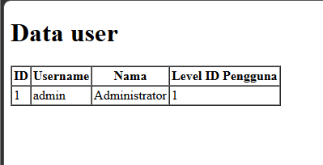
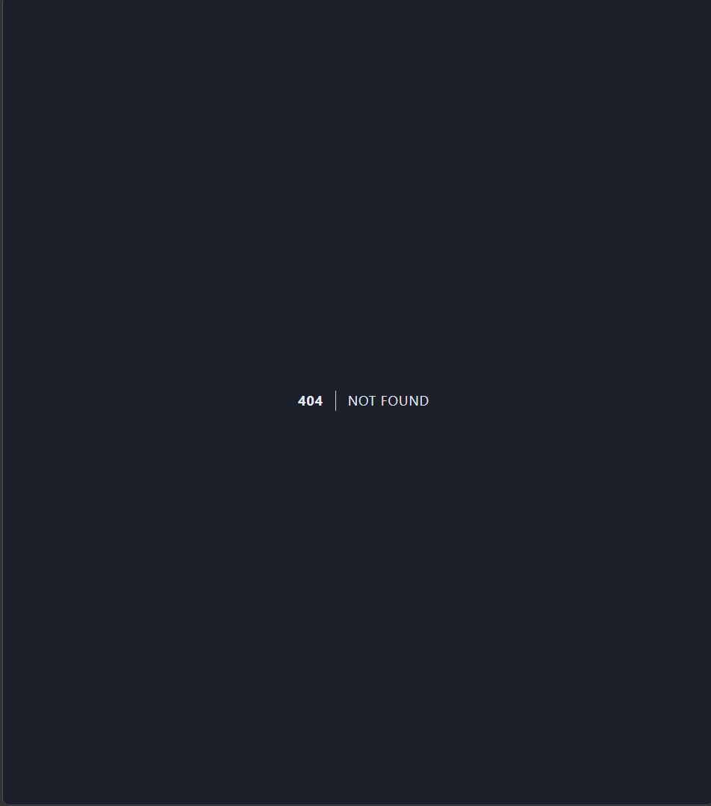
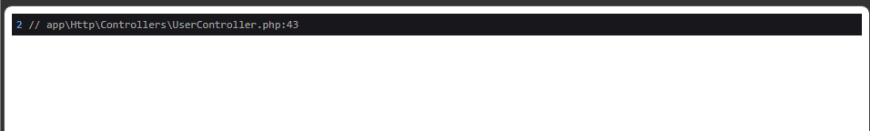
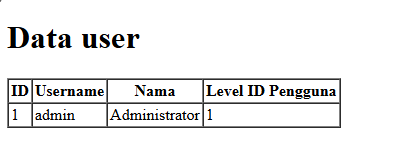
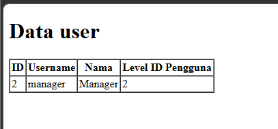
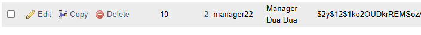
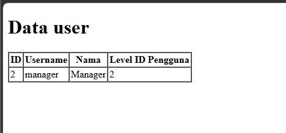
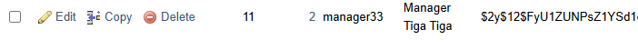
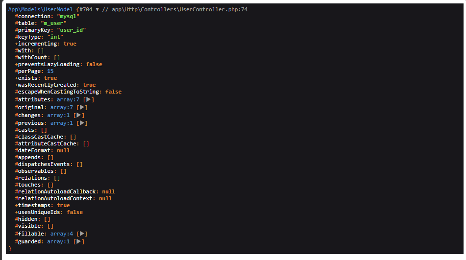

Praktikum 1

Tidak bisa karena password tidak ada pada fillable

Praktikum 2.1

tidak perlu memberikan foreach dalam user.blade.php dan bisa langsung mencari data nya

hanya mencari data yang ingin dicari

tidak ada karena data 20 tidak ada

Praktikum 2.1

findOrFail(1)

tidak ada karena manager9 tidak ada

Praktikum 2.2 

karena ada dd(user) yang berfungsi untuk debugging, dump and die ini akan menghentikan eksekusi script

Praktikum 2.3

mengganti count dengan get, dan mengganti view dgn menambahkan foreach

Praktikum 2.4

ambil data yang sudah ada atau membuat data baru

menambahkan data baru pada database

firstOrNew 

jika ingin menyimpan data pada database maka harus memberi tambahan user->save agar data tersimpan pada database

karena ada dump and die

