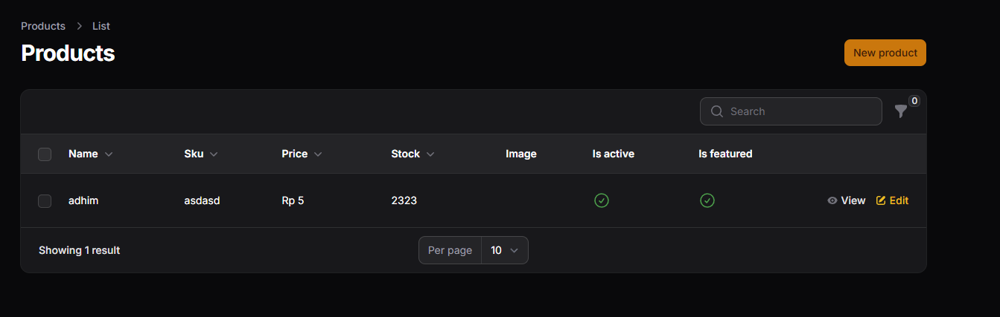

# JS07

ANALSIS dan DISKUSI

1. Mengapa Wizard Form lebih baik untuk form panjang?
	Wizard Form lebih baik karena memecah form yang panjang menjadi beberapa langkah kecil, sehingga pengguna lebih mudah fokus, tidak cepat lelah, dan tidak bingung melihat banyak field sekaligus.

2. Kapan kita menggunakan skippable()?
	`skippable()` digunakan ketika langkah tertentu boleh dilewati oleh pengguna. Ini cocok jika ada data tambahan yang sifatnya opsional atau tidak selalu diperlukan pada proses pengisian.

3. Apa kelebihan multi step dibanding single form panjang?
	Multi step lebih rapi, mudah dipahami, mengurangi beban visual, dan membantu pengguna mengisi data secara bertahap. Dibanding single form panjang, alurnya terasa lebih terstruktur dan user-friendly.

4. Apakah wizard cocok untuk semua jenis form?
	Tidak selalu. Wizard cocok untuk form yang kompleks, panjang, atau memiliki alur bertahap. Untuk form yang pendek dan sederhana, single form biasanya lebih cepat dan lebih efisien digunakan.
