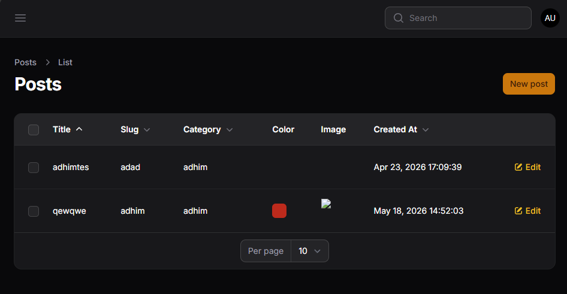
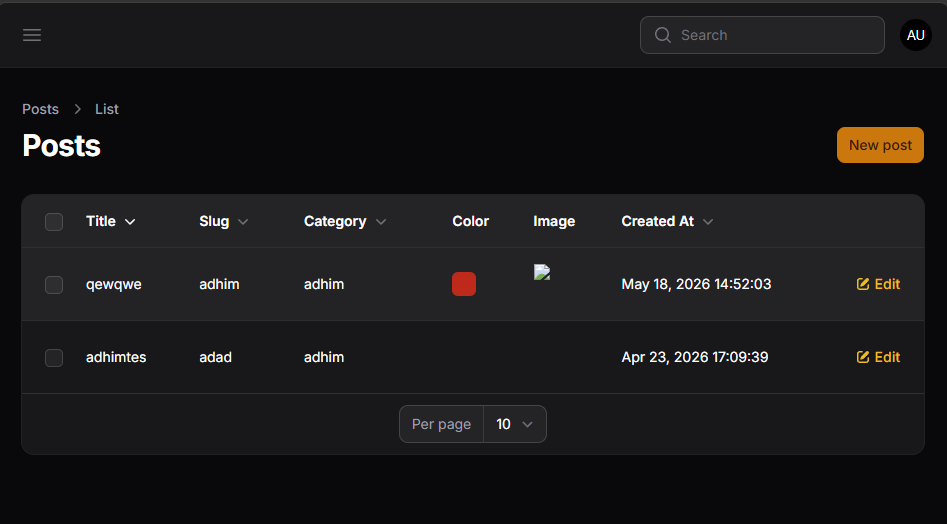
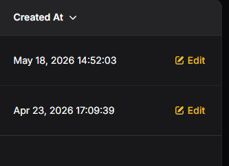

# LAPORAN PRAKTIKUM JOBSHEET10

Sorting title
Ascending

Descending

Bisa diurutkan berdasarkan tanggal terbaru atau terlama.

### L. Analisis & Diskusi
1. Mengapa sorting penting pada admin panel?
2. Apa perbedaan sortable biasa dengan defaultSort()?
3. Mengapa relasi tetap bisa di-sort?
4. Kapan kita menggunakan desc sebagai default?

### Jawab:
1. **Mengapa sorting penting pada admin panel?**
   
   Karena sorting sangat penting untuk efisiensi kerja. Admin sering kali perlu menemukan data terbaru, data dengan stok paling sedikit, atau produk paling mahal secara cepat. Tanpa sorting, admin harus mencari secara manual satu per satu, yang mana sangat tidak produktif jika datanya sudah mencapai ribuan.

2. **Apa perbedaan sortable biasa dengan defaultSort()?**
   
   - **sortable()**: Memberikan kemampuan kepada pengguna (admin) untuk mengurutkan kolom tersebut secara manual dengan mengklik judul kolom di tabel.
   - **defaultSort()**: Menentukan urutan awal saat halaman pertama kali dimuat dan memastikan daftar postingan langsung urut abjad dari A ke Z tanpa admin harus mengklik apa pun.

3. **Mengapa relasi tetap bisa di-sort?**
   
   Karena Filament secara otomatis melakukan pencarian ke tabel sebelah (tabel Kategori) di latar belakang. Jadi, meskipun data "Nama Kategori" tidak ada di tabel "Posts", Filament cukup pintar untuk mencarinya dan mengurutkannya seolah-olah itu satu kesatuan.

4. **Kapan kita menggunakan desc sebagai default?**
   
   Gunakan desc untuk data yang bersifat kronologis atau prioritas tinggi, contohnya:
   - **Tanggal dibuat (created_at)**: Supaya postingan yang baru saja kamu tulis muncul di baris paling atas.
   - **Harga Termahal**: Jika ingin melihat produk premium terlebih dahulu.
   - **ID**: Untuk melihat data terakhir yang masuk ke sistem.
