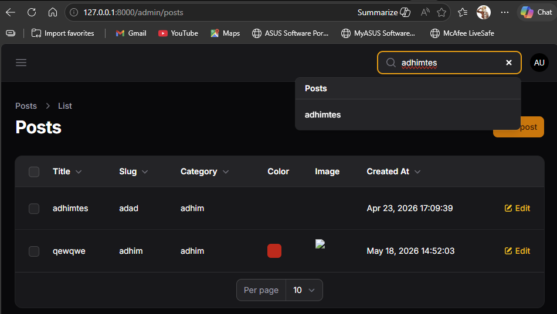
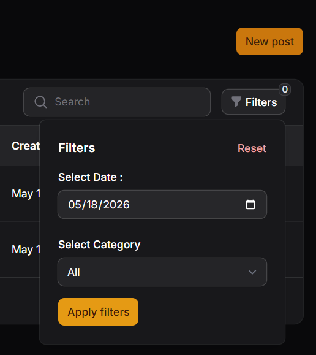

# LAPORAN PRAKTIKUM JOBSHEET11

search

filter tanggal

filter kategori

[alt text](image-5.png)

### H. Analisis & Diskusi
1. Mengapa search tidak cocok untuk filter tanggal?
	Search tidak cocok untuk filter tanggal karena search biasanya mencocokkan teks secara bebas, sedangkan tanggal membutuhkan pencocokan yang spesifik dan terstruktur. Jika memakai search biasa, hasilnya bisa kurang akurat karena format tanggal bisa berbeda dan hanya cocok sebagian.
2. Apa fungsi relationship() pada SelectFilter?
	`relationship()` pada `SelectFilter` berfungsi untuk mengambil opsi filter langsung dari relasi model. Dengan begitu, pilihan pada filter dropdown bisa diisi otomatis dari data tabel terkait seperti kategori, user, atau status.
3. Mengapa kita perlu whereDate() pada query filter?
	`whereDate()` diperlukan agar query hanya membandingkan bagian tanggalnya saja, bukan jam dan menit. Ini penting karena data di database sering disimpan dalam format timestamp, sehingga perbandingan biasa bisa gagal walaupun tanggalnya sama.
4. Apa perbedaan searchable() dan filters()?
	`searchable()` digunakan untuk membuat kolom atau pilihan bisa dicari dengan kata kunci, sedangkan `filters()` digunakan untuk menyaring data berdasarkan kondisi tertentu. Jadi, `searchable()` lebih cocok untuk pencarian cepat, sementara `filters()` lebih cocok untuk penyaringan yang spesifik.