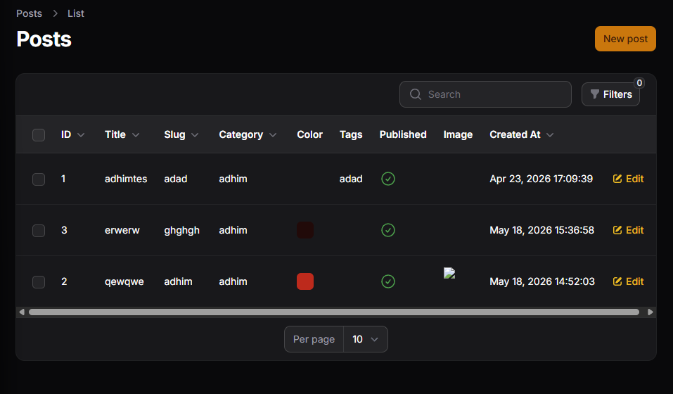
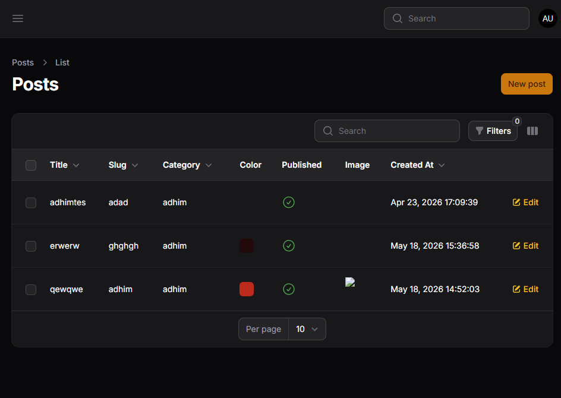
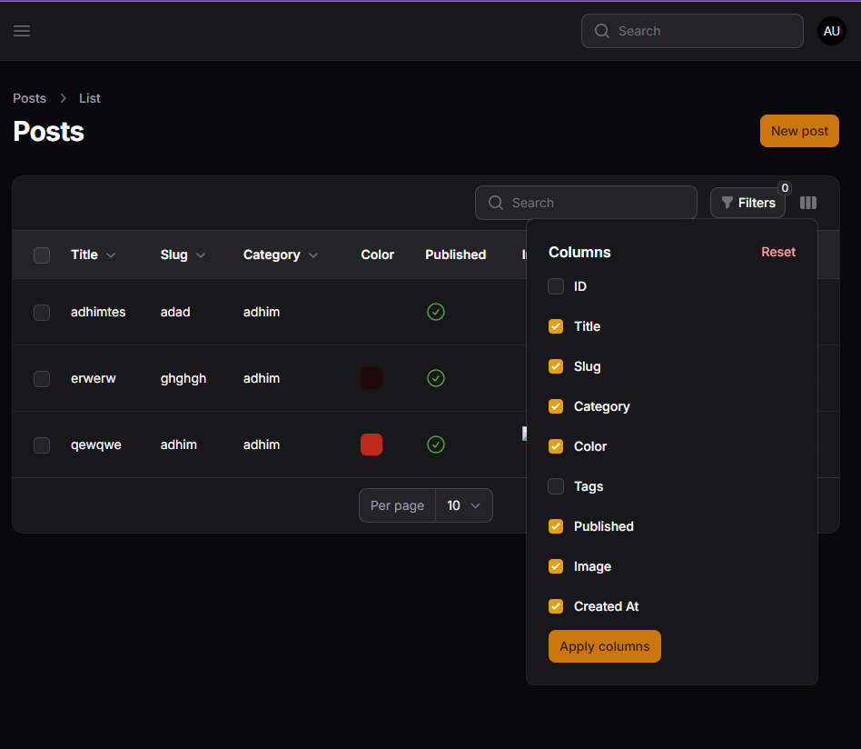

# LAPORAN PRAKTIKUM JOBSHEET12

### J. Analisis & Diskusi
1. Mengapa toggle column penting pada admin panel?
	Toggle column penting pada admin panel karena membuat tampilan data lebih fleksibel. Pengguna bisa menampilkan atau menyembunyikan kolom sesuai kebutuhan, sehingga tabel tidak terlalu penuh dan lebih mudah dibaca.
2. Apa perbedaan toggleable() biasa dengan isToggledHiddenByDefault?
	`toggleable()` biasa membuat kolom bisa dihidupkan atau dimatikan oleh pengguna, sedangkan `isToggledHiddenByDefault` menentukan apakah kolom tersebut awalnya disembunyikan saat halaman pertama kali dibuka.
3. Mengapa preferensi kolom tetap tersimpan?
	Preferensi kolom tetap tersimpan agar pengaturan yang dipilih pengguna tidak hilang saat halaman dimuat ulang. Hal ini membuat pengalaman penggunaan lebih nyaman karena tampilan tabel tetap sesuai kebiasaan pengguna.
4. Kapan sebaiknya kolom disembunyikan secara default?
	Kolom sebaiknya disembunyikan secara default jika kolom tersebut tidak selalu dibutuhkan, terlalu teknis, atau membuat tabel menjadi terlalu lebar. Dengan begitu, tampilan awal lebih ringkas dan fokus pada data yang paling penting.