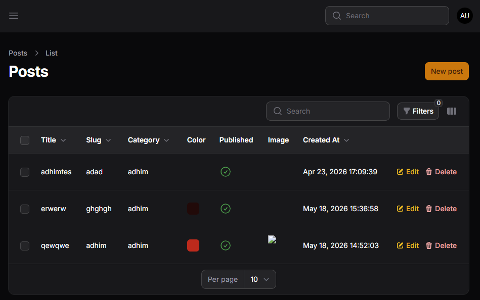
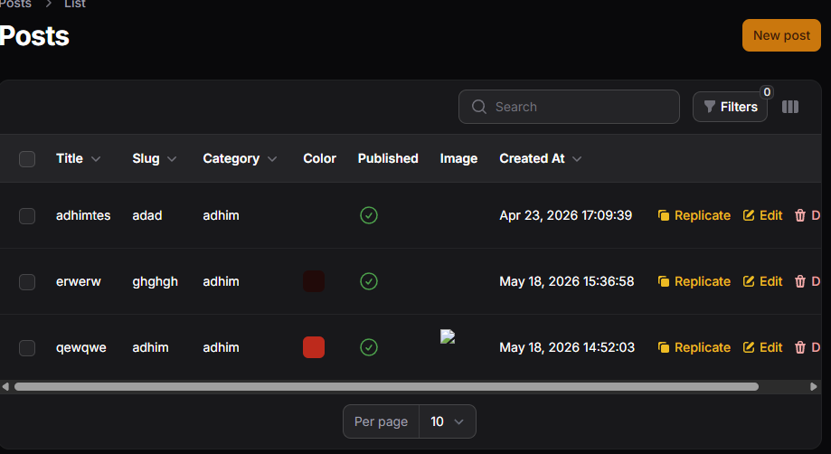
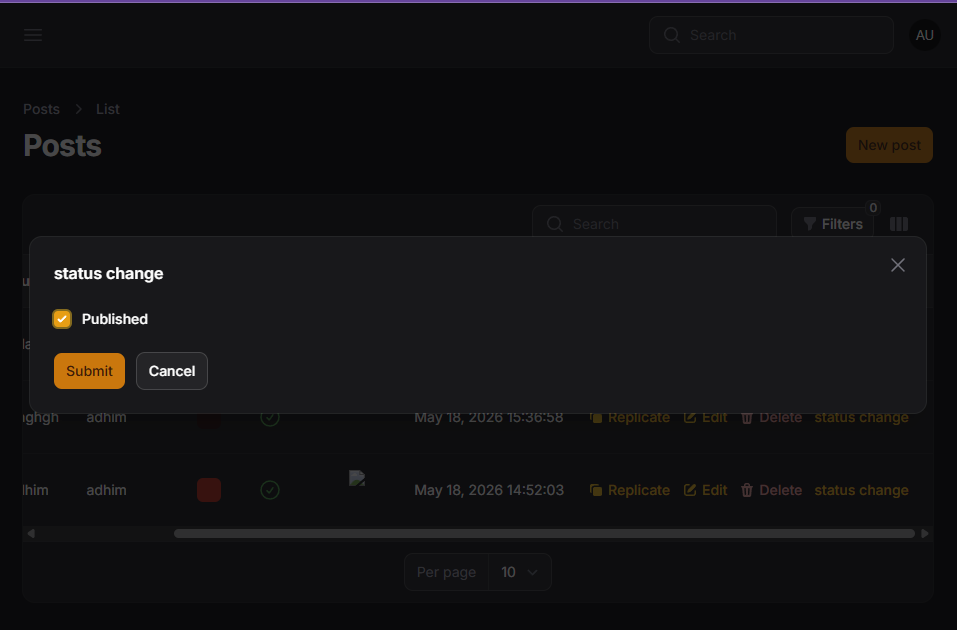
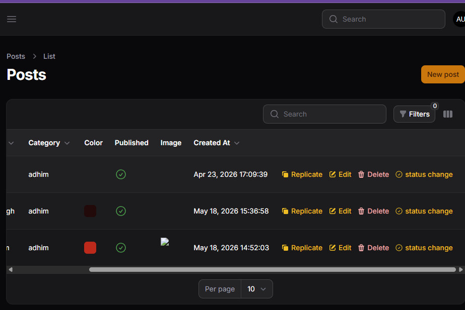

# LAPORAN PRAKTIKUM JOBSHEET12









### K. Analisis & Diskusi
1. Mengapa action di tabel lebih efisien dibanding halaman edit?
2. Apa perbedaan predefined action dan custom action?
3. Bagaimana cara menambahkan validasi dalam custom action?
4. Kapan kita menggunakan Replicate?

**Jawaban:**

1. Action di tabel lebih efisien karena memungkinkan perubahan cepat tanpa meninggalkan halaman daftar: pengguna dapat melakukan update satu atau beberapa field langsung dari baris tabel (inline/modal), mengurangi navigasi ke halaman edit, menghemat waktu, dan meningkatkan alur kerja terutama untuk perubahan sederhana atau mass-update.

2. Predefined action adalah aksi bawaan Filament (mis. `EditAction`, `DeleteAction`, `ReplicateAction`) yang sudah siap pakai dengan fungsionalitas umum. Custom action dibuat dengan `Action::make()` sehingga developer dapat menentukan label, ikon, form/schema, logika dan validasi sendiri untuk kebutuhan khusus yang tidak tersedia di aksi bawaan.

3. Untuk menambahkan validasi dalam custom action, gunakan form/schema untuk menangkap input dan jalankan validasi di dalam callback action sebelum menyimpan. Contoh singkat:

```php
use Illuminate\Support\Facades\Validator;

Action::make('status')
	->schema([
		Checkbox::make('published'),
	])
	->action(function ($record, $data) {
		Validator::make($data, [
			'published' => 'required|boolean',
		])->validate();

		$record->update(['published' => $data['published']]);
	});
```

4. Gunakan `Replicate` ketika Anda perlu menduplikasi (menyalin) sebuah entri untuk membuat entri baru yang mirip — misalnya membuat template post atau produk dengan data yang hampir sama. Replicate menghemat waktu dibanding membuat ulang data dari awal, namun pastikan menangani field unik (slug, id) atau relasi yang tidak boleh disalin secara langsung.
