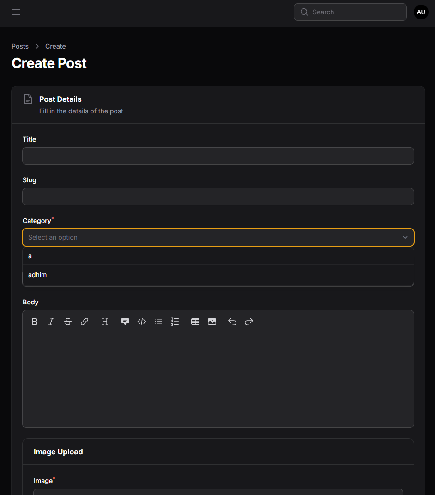
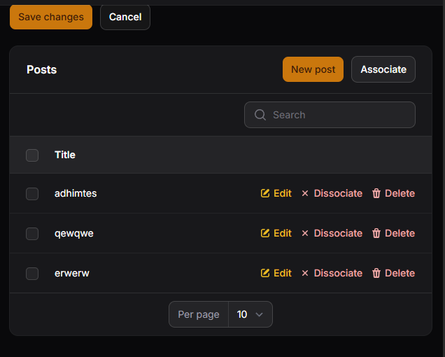
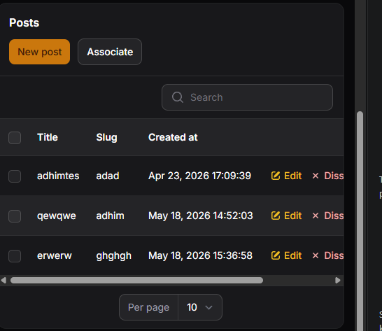

# LAPORAN PRAKTIKUM JOBSHEET14

### O. Analisis & Diskusi

1. Apa perbedaan `relationship()` dengan `options()`?

- `relationship()` menghubungkan field form atau filter ke relasi Eloquent sehingga Filament otomatis mengambil label dari model terkait dan menyimpan foreign key (mis. `->relationship('category', 'name')`). Cocok untuk data dinamis dan relasi database.
- `options()` menerima array statis key=>value yang Anda berikan sendiri (mis. `['1' => 'Laravel', '2' => 'PHP']`). Berguna untuk daftar kecil atau tetap yang tidak perlu query relasi.

2. Mengapa `searchable` penting untuk dataset besar?

- `searchable()` menghindari pemuatan semua opsi sekaligus dan memungkinkan pencarian dinamis (sering server-side). Ini mengurangi penggunaan memori, mempercepat waktu respons, dan meningkatkan pengalaman pengguna saat daftar opsi sangat besar.

3. Apa fungsi Relationship Manager pada Filament?

- `RelationManager` menyediakan antarmuka siap-pakai untuk mengelola record terkait (list, create, edit, attach/detach, bulk actions) dari halaman resource induk. Biasanya dipakai untuk relasi `hasMany` atau `belongsToMany` sehingga admin dapat mengelola koleksi anak tanpa berpindah resource.

4. Kapan menggunakan `HasMany` dan `BelongsTo`?

- Gunakan `HasMany` di model induk (mis. `Category->posts()` — satu category memiliki banyak posts) ketika model memiliki koleksi anak.
- Gunakan `BelongsTo` di model anak (mis. `Post->category()` — setiap post milik satu category) ketika menyimpan foreign key pada tabel anak. Di Filament: untuk memilih parent gunakan `Select->relationship()` (belongsTo), sedangkan untuk mengelola koleksi anak gunakan `RelationManager` (hasMany).